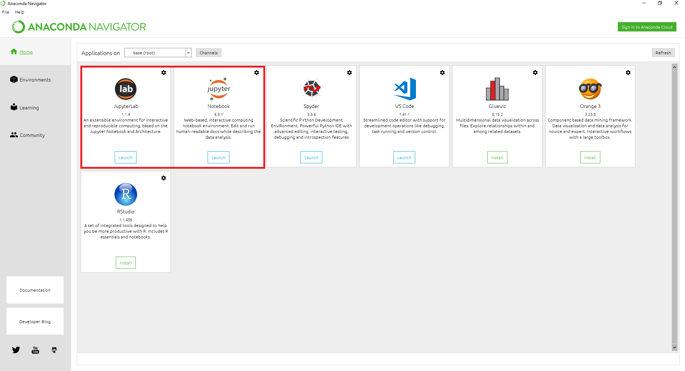
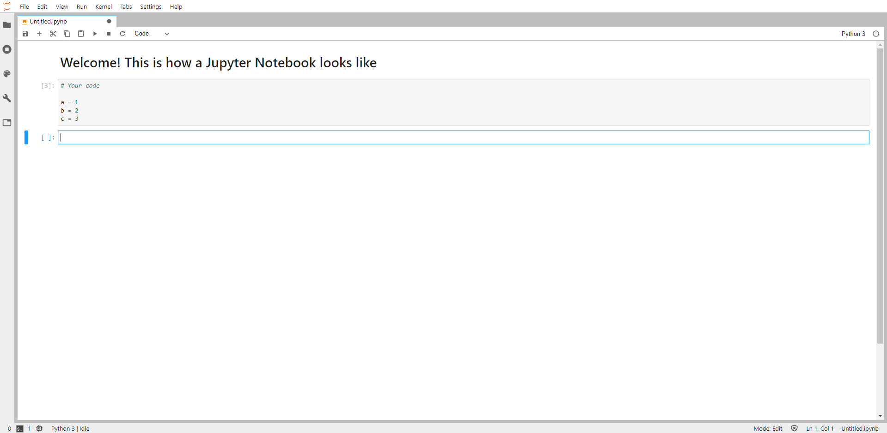

# Instructions
This repo contains instructions about how to use GitHub. Participants to the course are expected to follow a few simple rules in order to faciliate joint works and ensure reproducibility. 

## Dictionary
When learning a new language, one has to start from the basics. GitHub most fundamental words are: **repository**, **branch**, **merge**, **push** and **pull**. Take a look at [Hello World - GitHub](https://guides.github.com/activities/hello-world/) for a brief explanation of each of them.

## Installing GitHub Desktop
In this course, we interact with GitHub through the GitHub Desktop application. Download and install (GitHub Desktop)[https://desktop.github.com] on your computer. The installation process creates a folder named "GitHub". Make sure to know where it is located on your computer and/or change its directory where you prefer (e.g. Desktop).

## Class Organization
Each class has its own repository. You can find it under the [course homepage](https://github.com/Python-do-ECARES). In order to work on the weekly exercises, please follow the following instructions. 

### Step 1. Clone repository
Go to the relevant repo page on GitHub and click on the "Clone or download" button.

Choose "Open in Desktop".

This will open a window in your GitHub Desktop environment. Check the local path where to clone the repo and click "Clone".

### Step 2. Make Changes
Open the file "Main_init.py" in your favourite compiler (e.g. VS Code). Add a comment line with your name.

Save the file. Changes will be displayed in GitHub Desktop as follows.

### Step 3. Create Your Own Branch And Commit Changes
Click on "Master" in the top panel. Then click on "New Branch". 

Give the new branch your name. Then click "Create Branch".

Switch changes to your own branch. 

Publish your branch online.

Commit changes to your branch. **Never directly commit your changes to the Master**.

Your directory will now appear under the repo GitHub webpage as follows

### Step 4. Next Steps
From now on, you can commit your chanes to your own branch anytime you want. You can also navigate to other people branches and see what they are up to. Do not commit to their branches directly. Instead, you can open a pull request.

